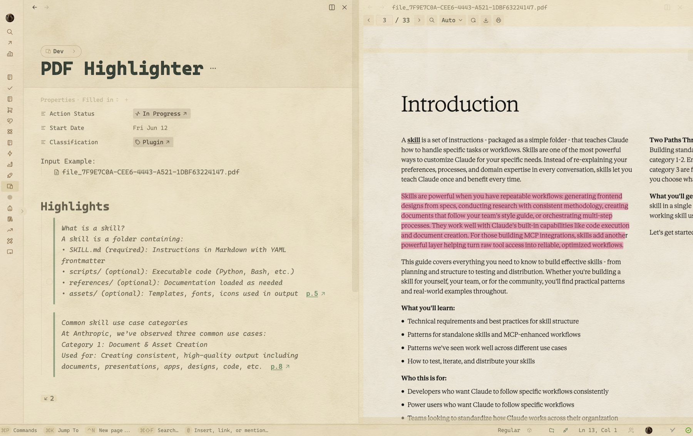
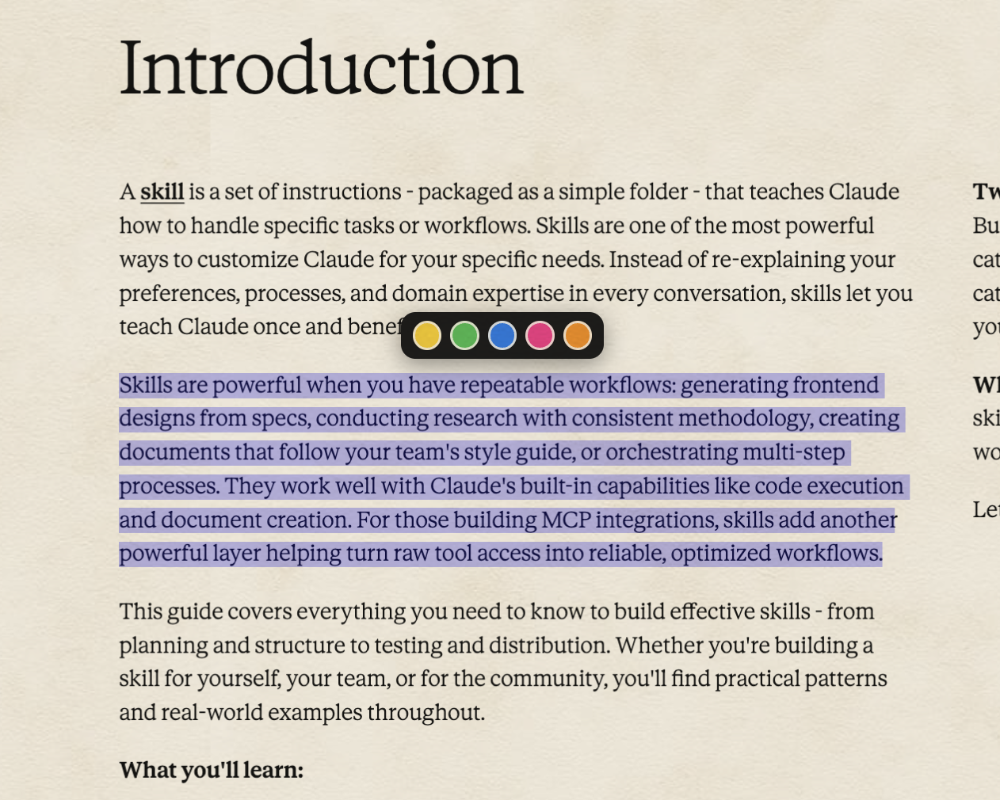

# PDF Highlighter

PDF Highlighter is a [Thymer](https://thymer.com) plugin for highlighting text in a PDF attached to a note and pulling it straight into the note. Open a PDF, select a passage, pick one of five colours, and the text lands in your note as a quote — colour-coded, grouped under a **Highlights** heading, and tagged with a clickable backlink to the exact page. Click the backlink any time to jump back into the PDF, where the plugin scrolls to the passage and pulses your highlight. The highlight stays painted over the text in the PDF too, and survives reloads.

**Scanned PDFs work too.** On an image-only page (no selectable text), drag a box around the text instead of selecting it; the plugin runs OCR on that region and drops the recognised text into your note with the same colour, backlink, and overlay.

It works by hooking Thymer's own built-in PDF preview (which is [PDF.js](https://mozilla.github.io/pdf.js/) under the hood), so there's no second viewer to load and nothing to slow down — your PDF opens beside your note exactly as it always does, just with highlighting added.

## How to use

1. **Attach a PDF to a note** — drag a PDF into the note (it appears as a file in the body).
2. **Open it** — click the attached PDF. Thymer opens it in a preview panel next to the note.
3. **Highlight** — select some text in the PDF. A small colour toolbar appears just above your selection; click a colour. The passage is painted in that colour in the PDF and added to the note's **Highlights** section as a quote block, ending with a `p.N ↗` backlink.

   

4. **Jump back** — click the `p.N ↗` link (or its arrow) on any extract. The PDF jumps to that page and pulses the highlight. If the PDF is closed, it reopens beside the note first.
5. **Recolour or delete** — right-click a highlight in the PDF. A small menu appears: pick a different colour to recolour it (updated in both the PDF and the note), or **Delete highlight** to remove it along with its extract from the note.

**On a scanned (image-only) page** there's no text to select, so instead **drag a box** around the text you want. The colour toolbar appears above the box; pick a colour and the plugin OCRs that region (first use downloads the recognition engine, which takes a moment) and adds the recognised text to your note — same colours, backlink, overlay, and delete. Drawing a snug box around just the lines you want gives the cleanest result.

Good to know:

- **Five colours.** Pick any of them per highlight; the extract carries the colour, and you can right-click a highlight to recolour it later. (Mapping colours to meanings is on the roadmap.)
- **Multi-line and multi-paragraph extracts** are preserved — headings stay on their own line, bullet lists stay multiline, and wrapped lines flow back together into clean paragraphs.
- **Highlights persist.** They're reconstructed from the note's text, so they come back after a reload even if the PDF was closed — as long as the note is open beside the PDF.
- **Lossless text on real PDFs.** When a page has a text layer, the plugin reads the actual characters, so the extracted text is exact (no OCR errors). Scanned pages fall back to OCR automatically.

## Scanned PDFs (OCR)

Pages that are just images (scans, photographed documents) have no text layer to read, so the plugin falls back to OCR:

- It detects an image-only page automatically. There you **drag a box** instead of selecting text.
- The boxed region is rendered at high resolution straight from the page and run through [Tesseract](https://github.com/naptha/tesseract.js) (English), entirely on your machine — nothing is uploaded.
- The recognised text is added to your note exactly like a normal highlight: same colours, backlink, coloured overlay, and delete.

Good to know:

- **First use downloads the OCR engine** (~a few MB) from a CDN; after that it's cached. OCR needs an internet connection the first time.
- **English only** for now, and accuracy depends on the scan quality — a clean, snug box around the lines you want reads best.
- OCR text isn't perfect the way text-layer extraction is, so give it a quick proofread.

## Installation

1. In Thymer, open the Command Palette (`Cmd+P` / `Ctrl+P`), run **Plugins**, and click **Create Plugin** under Global Plugins.
2. In the plugin's dialog, go to the code editor (click **Edit as Code** if you see the settings view).
3. In the **Custom Code** tab, replace the contents with [`plugin.js`](plugin.js).
4. In the **Configuration** tab, replace the contents with [`plugin.json`](plugin.json).
5. Click **Save**.

Don't enable Hot Reload — it's a development feature and can leave the plugin in a state where saved data stops persisting.

## How it works

- Thymer renders an attached PDF in a same-origin PDF.js iframe. The plugin watches for that viewer, reaches into its `PDFViewerApplication`, and adds a selection toolbar, a coloured overlay layer, and the highlight → extract flow — without rendering its own copy of the PDF.
- Extracted text comes from the PDF's text layer (exact characters, line/paragraph structure reconstructed from the text geometry). Each extract is a quote block whose backlink is a normal link plus a Tabler arrow icon, so it reads — and behaves — like a native Thymer page reference.
- Highlights are stored against the PDF's stable fingerprint and, more importantly, re-derived from the extract text in your note, which is why they survive reloads. The backlink carries the page, colour, and a highlight id so a click can reopen the PDF, scroll to the passage, and flash the right highlight.
- On image-only pages the plugin re-renders the boxed region from PDF.js at ~300 DPI and runs it through a lazily-loaded Tesseract worker. OCR highlights carry their box (as a normalised rectangle) in the backlink, so the overlay is reconstructable from your note alone — no text layer needed.

## Acknowledgements

Built on top of an initial version by **Theodore** from the Thymer Discord community — thanks for the head start and the idea.

## License

[MIT](LICENSE)
