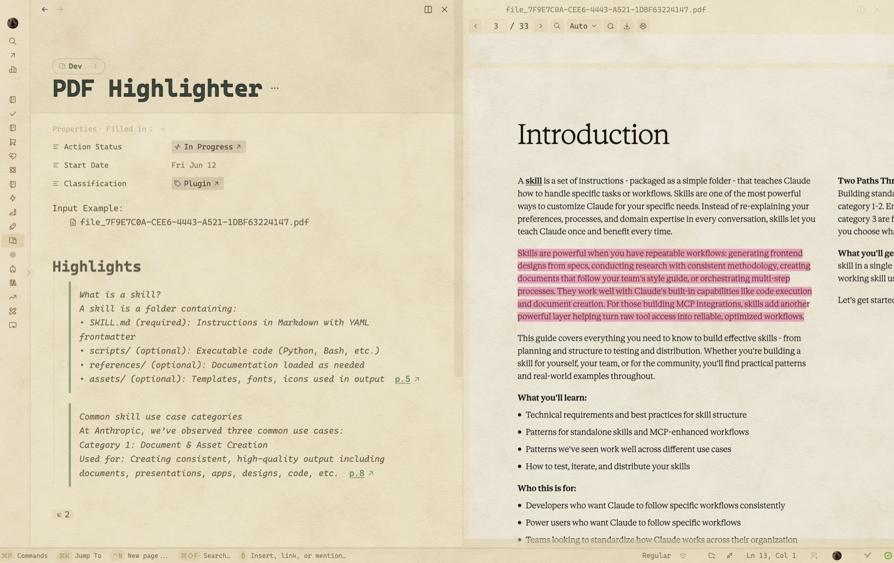
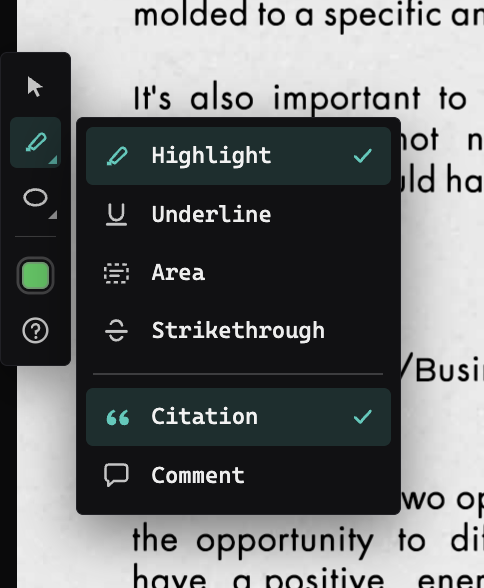
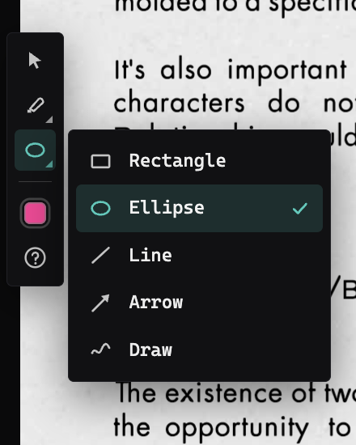
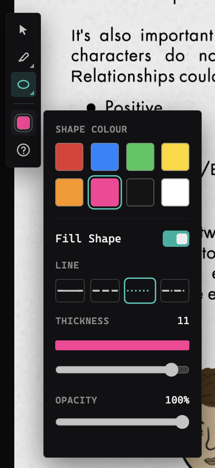

# PDF Highlighter

PDF Highlighter is a [Thymer](https://thymer.com) plugin for highlighting text in a PDF attached to a note and pulling it straight into the note. Open a PDF and select a passage, and the text lands in your note as a colour-coded quote, grouped under a **Highlights** heading and tagged with a clickable backlink to the exact page. Click the backlink any time to jump back into the PDF, where the plugin scrolls to the passage and pulses your highlight. The highlight stays painted over the text in the PDF too, and survives reloads.

**There's a tool rail for the rest of it.** Underline and strike text, capture a whole region in one drag, draw rectangles, ellipses, lines, arrows and freehand over the page, and write your own comment instead of a quote. Everything you mark lands in the note, so the note is always the record of what you did.

**Scanned PDFs work too.** On an image-only page (no selectable text), drag a box around the text instead of selecting it; the plugin runs OCR on that region and drops the recognised text into your note with the same colour, backlink, and overlay.

It works by hooking Thymer's own built-in PDF preview (which is [PDF.js](https://mozilla.github.io/pdf.js/) under the hood), so there's no second viewer to load and nothing to slow down — your PDF opens beside your note exactly as it always does, just with highlighting added.

## How to use

1. **Attach a PDF to a note** — drag a PDF into the note (it appears as a file in the body).
2. **Open it** — click the attached PDF. Thymer opens it in a preview panel next to the note.
3. **Highlight** — select some text and it's instantly highlighted in your current colour and added to the note's **Highlights** section as a quote block, ending with a `p.N ↗` backlink. No picking a colour each time; it uses your current one (yellow to start), and you can recolour afterwards.

   - **Collect into one quote** — hold **⌘** while selecting to merge the passage into your previous quote. The block keeps **one** citation with a single backlink at the end, so gathering a passage that breaks across ragged line ends reads as one quotation. (Merging stops at a page break, where a single link could only point at one of the pages.)
   - **Write your own note** — hold **⌥** while selecting to drop an empty **note block** linked to that spot in the PDF, with no extracted text. Click into it and type.

4. **Jump back** — click the `p.N ↗` link (or its arrow) on any extract. The PDF jumps to that page and pulses the highlight. If the PDF is closed, it reopens beside the note first.
5. **Restyle or delete** — right-click a highlight or a shape in the PDF. The style panel opens at the cursor: change its colour (and for an underline or strikethrough, its weight), or delete it along with its entry in the note.

### The tool rail

A compact rail floats over the left edge of the PDF panel. Each button shows what it will do, and its menu opens from the button's bottom edge or a right-click — a plain click just uses the tool.

**Text** marks the selection, and holds two independent choices that combine:

- **Highlight**, **Underline** and **Strikethrough** decide how the PDF is marked. A strikethrough files its note in a **warning** block.
- **Area** swaps text-selection for a box: drag over a column or a whole paragraph and the text inside is captured. On a page with real text that is exact, character for character; on a scanned page the same drag runs OCR instead.
- **Citation** puts the quoted passage in the note. **Comment** gives you an empty block to write in.

**Shapes** draws over the page. Every shape writes a note block with a line to say why it's there:

With the **Select** arrow, click a shape to select it, drag it to move it, drag a handle to resize it, and press **Delete** to remove it.

**Style** sets colour, fill, line type, thickness and opacity — for new marks, or for whatever you have selected:

Right-click any shape or highlight to open the same panel at the cursor, with a delete button. The **?** button lists every gesture, in case you forget one.

**On a scanned (image-only) page** there's no text to select, so instead **drag a box** around the text you want. The plugin OCRs that region (first use downloads the recognition engine, which takes a moment) and adds the recognised text to your note in your current colour, with the same backlink, overlay, and delete. Drawing a snug box around just the lines you want gives the cleanest result.

Good to know:

- **Colours.** Five for highlights, eight for shapes (a shape outline wants black and white; a highlight doesn't). Right-click anything to recolour it, and that colour becomes the default for new ones.
- **Structure is preserved.** Headings stay on their own line, wrapped lines flow back into clean paragraphs, and a captured list becomes a real Thymer list rather than text that happens to start with a bullet.
- **Highlights persist.** They're reconstructed from the note's text, so they come back after a reload even if the PDF was closed — as long as the note is open beside the PDF.
- **Lossless text on real PDFs.** When a page has a text layer, the plugin reads the actual characters, so the extracted text is exact (no OCR errors). Scanned pages fall back to OCR automatically.
- **Group under a heading, or not.** Extracts sit under a **Highlights** heading by default. Run **PDF Highlighter: Toggle Highlights heading** from the Command Palette (`Cmd+P` / `Ctrl+P`) to instead drop new extracts at the end of the note.
- **Your settings are remembered** across reloads — colours, line type, thickness, opacity, OCR language, the text mode and the heading setting.
- **It follows your theme.** The rail, menus and panels use Thymer's own colours, and a selected shape is outlined in your theme's accent, so it fits whichever of Thymer's themes you use.

## Scanned PDFs (OCR)

Pages that are just images (scans, photographed documents) have no text layer to read, so the plugin falls back to OCR:

- It detects an image-only page automatically. There you **drag a box** instead of selecting text.
- The boxed region is rendered at high resolution straight from the page and run through [Tesseract](https://github.com/naptha/tesseract.js), entirely on your machine — nothing is uploaded.
- The recognised text is added to your note exactly like a normal highlight: same colours, backlink, coloured overlay, and delete.
- **Multi-line capture.** To grab a passage that starts mid-sentence or skips ragged line-ends, **hold Shift and drag a box on each piece** (end of one line, the next line, part of a third); release Shift and they're OCR'd together into one extract. **Esc** discards the pending boxes.
- **Merge or comment a boxed passage.** The same **⌘** (merge into your previous quote) and **⌥** (empty note block) modifiers work while boxing, and combine with Shift. They're read when you *release* the mouse, so you can scroll first and press the key just before letting go.

Good to know:

- **Languages.** English, Swedish, German, French, Spanish, Greek, and Hebrew. Set the language from the Command Palette (`Cmd+P` / `Ctrl+P`) — there's a command per language, e.g. **PDF Highlighter: Swedish**. Your choice is remembered.
- **First use downloads models** from a CDN — the OCR engine, plus each language's data the first time you use that language (a few MB each, cached afterwards). OCR needs an internet connection the first time.
- Accuracy depends on the scan quality — a clean, snug box around the lines you want reads best — and OCR text isn't perfect the way text-layer extraction is, so give it a quick proofread.

## Installation

1. In Thymer, open the Command Palette (`Cmd+P` / `Ctrl+P`), run **Plugins**, and click **Create Plugin** under Global Plugins.
2. In the plugin's dialog, go to the code editor (click **Edit as Code** if you see the settings view).
3. In the **Custom Code** tab, replace the contents with [`plugin.js`](plugin.js).
4. In the **Configuration** tab, replace the contents with [`plugin.json`](plugin.json).
5. Click **Save**.

Don't enable Hot Reload — it's a development feature and can leave the plugin in a state where saved data stops persisting.

## How it works

- Thymer renders an attached PDF in a same-origin PDF.js iframe. The plugin watches for that viewer, reaches into its `PDFViewerApplication`, and adds a selection toolbar, a coloured overlay layer, and the highlight → extract flow — without rendering its own copy of the PDF.
- Extracted text comes from the PDF's text layer (exact characters, line/paragraph structure reconstructed from the text geometry). Each extract is a quote block whose backlink is a normal link plus a Tabler arrow icon, so it reads — and behaves — like a native Thymer page reference.
- Highlights are stored against the PDF's stable fingerprint and, more importantly, re-derived from the extract text in your note, which is why they survive reloads. The backlink carries the page, colour, and a highlight id so a click can reopen the PDF, scroll to the passage, and flash the right highlight.
- On image-only pages the plugin re-renders the boxed region from PDF.js at ~300 DPI and runs it through a lazily-loaded Tesseract worker. OCR highlights carry their box (as a normalised rectangle) in the backlink, so the overlay is reconstructable from your note alone — no text layer needed.

## Acknowledgements

Built on top of an initial version by **Theodore** from the Thymer Discord community — thanks for the head start and the idea.

## License

[MIT](LICENSE)
